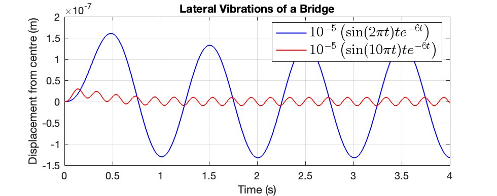
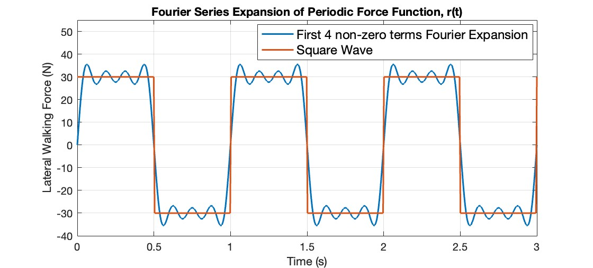
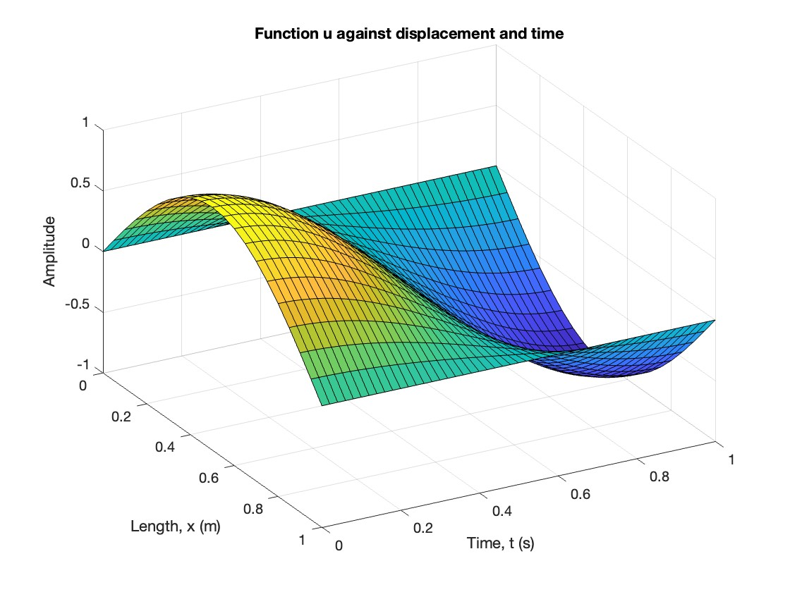
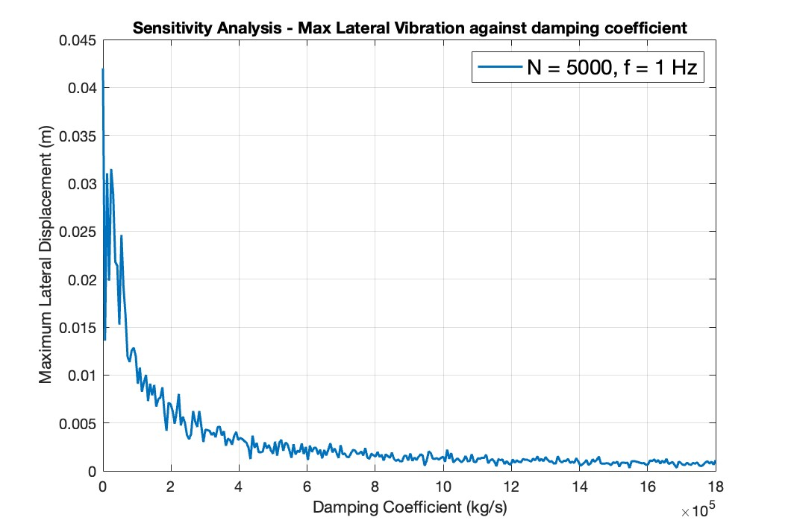
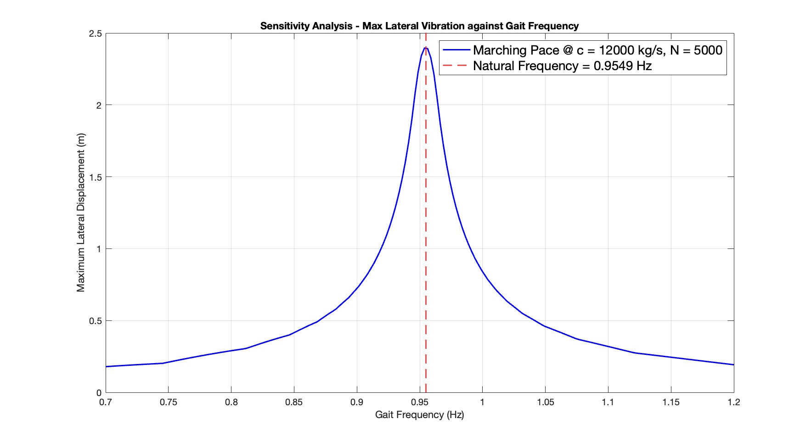

# Bridge Oscillation Simulation

This project contains MATLAB simulations for analyzing lateral vibrations and oscillations in bridges, with a focus on pedestrian-induced loading effects.

## Overview

The simulation suite models various aspects of bridge dynamics, including:
- Lateral vibrations from external forcing functions
- Periodic walking forces using Fourier series
- Wave equation solutions for bridge dynamics
- Sensitivity analysis of key parameters affecting bridge oscillations

## Project Structure

```
ENGF0004 Coursework 1/
├── q1.m              # Lateral vibration simulation using convolution
├── q2.m              # Fourier series expansion of periodic walking force
├── q4.m              # Wave equation solution using finite difference method
├── q5.m              # Sensitivity analysis (damping, number of people, frequency)
├── Figures/          # Generated plots and visualizations
└── README.md         # This file
```

## Simulation Components

### 1. Lateral Vibration Analysis (`q1.m`)

Simulates lateral bridge vibrations using convolution of forcing functions with the system's impulse response.

**Key Features:**
- Models vibrations from sinusoidal forcing functions
- Uses convolution:
  $$x(t) = 10^{-5} \cdot \text{conv}(F(t), G(t)) \cdot dt$$
- Forcing functions: $\sin(2\pi t)$ and $\sin(10\pi t)$
- Impulse response: $t \cdot e^{-6t}$

**Output:** Time-domain displacement plots showing lateral vibrations over a 4-second period.

<div align="center">
  
</div>

### 2. Periodic Walking Force Model (`q2.m`)

Models the periodic lateral force generated by pedestrians using Fourier series expansion.

**Key Features:**
- Square wave representation of walking force
- Fourier series with first 4 non-zero terms
- Parameters:
  - Gait frequency: $f = 1\text{ Hz}$
  - Force magnitude: $G = 30 \text{ N}$

**Mathematical Model:**
$$r(t) = \frac{4G}{\pi} \left[ \sin(2\pi ft) + \frac{1}{3}\sin(6\pi ft) + \frac{1}{5}\sin(10\pi ft) + \frac{1}{7}\sin(14\pi ft) \right]$$

**Output:** Comparison plot of square wave vs. Fourier series approximation.

<div align="center">
  
</div>

### 3. Wave Equation Solution (`q4.m`)

Solves the one-dimensional wave equation using finite difference methods.

**Key Features:**
- Finite difference time-stepping scheme
- Boundary conditions: $u(0,t) = 0$, $u(L,t) = 0$
- Initial condition: $u(x,0) = \sin(\pi x)$
- Spatial step: $dx = 0.25 \text{ m}$
- Time step: $dt = 0.1 \text{ s}$

**Output:** 3D surface plot showing wave propagation over time and space.

<div align="center">
  
</div>

### 4. Sensitivity Analysis (`q5.m`)

Comprehensive parameter sensitivity study for bridge oscillation behavior.

**Analyzed Parameters:**

1. **Number of People (N)**
   - Range: 1 to 5000 people
   - Effect on total mass: $m = 70N + 1 \times 10^5 \text{ kg}$
   - Analyzes maximum lateral displacement vs. pedestrian count

<div align="center">
  
</div>

2. **Damping Coefficient (c)**
   - Range: 0 to $1.8 \times 10^5 \text{ kg/s}$
   - Studies effect of damping on vibration amplitude
   - Includes both linear and logarithmic scale plots

<div align="center">
  
</div>

<div align="center">
  
</div>

3. **Gait Frequency (f)**
   - Range: $0.7$ to $1.2 \text{ Hz}$
   - Compares marching (synchronized) vs. normal (random phase) walking
   - Identifies resonance conditions near natural frequency

<div align="center">
  
</div>

<div align="center">
  
</div>

**Bridge Parameters:**
- Base mass: $m = 1 \times 10^5 \text{ kg}$
- Stiffness: $k = 3.6 \times 10^6 \text{kg/s}^{2}$
- Initial damping: $c = 1.2 \times 10^4 \text{ kg/s}$
- Natural frequency: $f_n = \frac{1}{2\pi}\sqrt{\frac{k}{m}} \text{ Hz}$

**Mathematical Model:**
The simulation uses convolution to solve the second-order differential equation:
$$m\ddot{x} + c\dot{x} + kx = F(t)$$

The impulse response $G(s)$ is determined based on the discriminant:
- **Overdamped ($\Delta > 0$):** Two real roots
- **Critically damped ($\Delta = 0$):** Repeated real root
- **Underdamped ($\Delta < 0$):** Complex conjugate roots (oscillatory)

**Output:** Multiple plots showing maximum lateral displacement as a function of each parameter, with natural frequency markers for resonance analysis.

<div align="center">
  
</div>

## Usage

### Running Individual Simulations

1. **Basic Vibration Analysis:**
   ```matlab
   run('q1.m')
   ```

2. **Walking Force Model:**
   ```matlab
   run('q2.m')
   ```

3. **Wave Equation:**
   ```matlab
   run('q4.m')
   ```

4. **Sensitivity Analysis:**
   ```matlab
   run('q5.m')
   ```
   *Note: This simulation may take several minutes to complete due to nested loops.*

## Key Results

The sensitivity analysis (`q5.m`) reveals important insights:

1. **Resonance Effects:** Maximum vibrations occur when gait frequency approaches the bridge's natural frequency
2. **Damping Impact:** Higher damping significantly reduces vibration amplitude, especially in the underdamped regime
3. **Crowd Effects:** Increasing pedestrian count increases both mass and forcing, leading to complex vibration behavior
4. **Synchronization:** Marching (synchronized) walking produces significantly higher vibrations than normal (random phase) walking

## Technical Details

### Convolution Method
The simulations use discrete convolution to compute the system response:
$$x(t) = \text{conv}(F(t), G(t)) \cdot dt$$
where:
- $F(t)$ is the forcing function
- $G(t)$ is the impulse response (Green's function)
- $dt$ is the time step for proper scaling

### Finite Difference Scheme
The wave equation uses a central difference scheme:
$$u(i,j+1) = \frac{42}{25}u(i,j) + \frac{4}{25}\left(u(i-1,j) + u(i+1,j)\right) - u(i,j-1)$$

### Superposition Principle
For multiple pedestrians, individual forces are summed:
$$F_s = \sum_{i=1}^{N} r_i(t + \phi_i)$$
where $\phi_i$ is the random gait phase for each pedestrian.

## Dependencies

- MATLAB R2018b or later
- No additional toolboxes required (uses base MATLAB functions)

## Figures

Generated plots are saved in the `Figures/` directory, including:
- Vibration time histories
- Fourier series comparisons
- Wave propagation surfaces
- Sensitivity analysis curves
- Resonance frequency markers

## Notes

- All time steps ($dt$) and spatial steps ($dx$) are chosen to ensure numerical stability
- The sensitivity analysis uses Monte Carlo-style random phase generation for realistic pedestrian behavior
- Results are sensitive to the chosen parameter ranges; adjust in `q5.m` as needed

