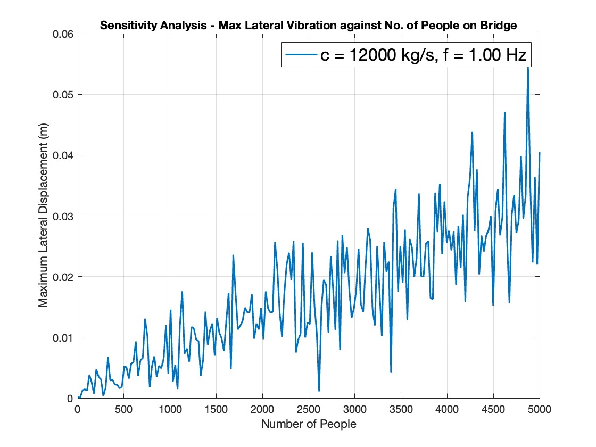
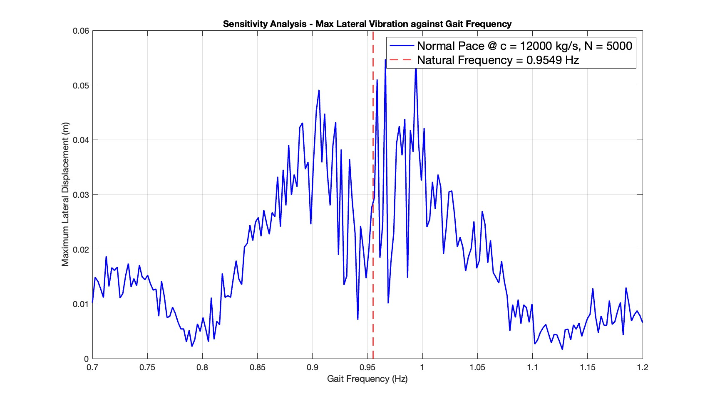
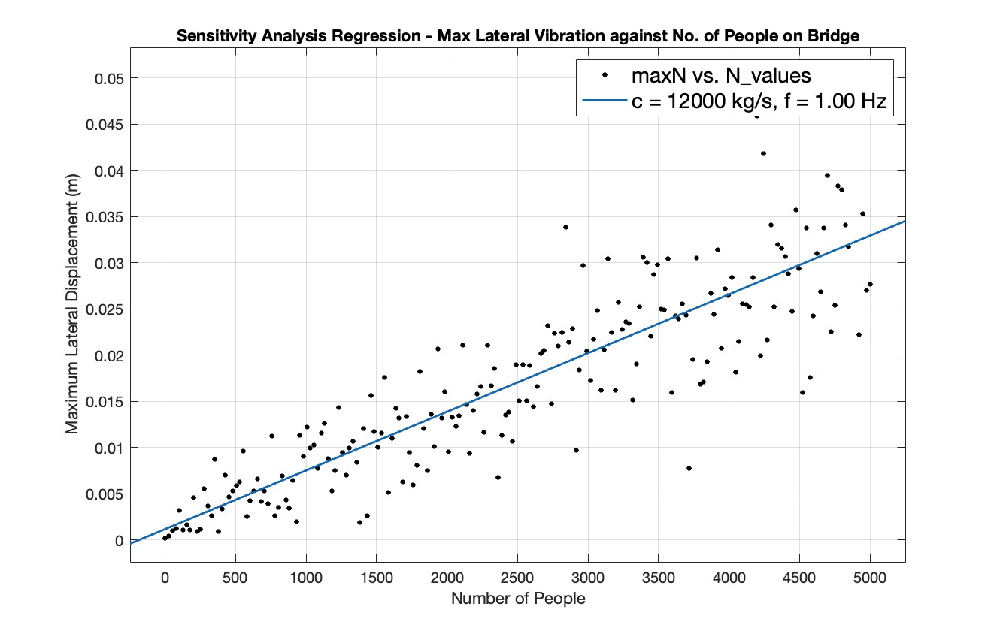

# Bridge Oscillation Simulation

This project contains MATLAB simulations for analyzing lateral vibrations and oscillations in bridges, with a focus on pedestrian-induced loading effects. Originally developed as coursework, this project has been continuously improved and refined after submission for ongoing development and learning purposes.

## Table of Contents

- [Overview](#overview)
- [Project Structure](#project-structure)
- [Simulation Components](#simulation-components)
  - [1. Lateral Vibration Analysis](#1-lateral-vibration-analysis)
  - [2. Periodic Walking Force Model](#2-periodic-walking-force-model)
  - [3. Wave Equation Solution](#3-wave-equation-solution)
  - [4. Sensitivity Analysis](#4-sensitivity-analysis)
- [Usage](#usage)
  - [Prerequisites](#prerequisites)
  - [Getting Started](#getting-started)
  - [Available Simulations](#available-simulations)
- [Key Results](#key-results)
- [Technical Details](#technical-details)

## Overview

The simulation suite models various aspects of bridge dynamics, including:
- Lateral vibrations from external forcing functions
- Periodic walking forces using Fourier series
- Wave equation solutions for bridge dynamics
- Sensitivity analysis of key parameters affecting bridge oscillations

## Project Structure

```
Bridge-Simulation/
├── lateral_vibration.m    # Lateral vibration simulation using convolution
├── walking_force.m        # Fourier series expansion of periodic walking force
├── wave_equation.m        # Wave equation solution using finite difference method
├── sens_analysis.m        # Sensitivity analysis (damping, number of people, frequency)
├── figures/               # Generated plots and visualizations
└── README.md              # This file
```

## Simulation Components

<a id="1-lateral-vibration-analysis"></a>
### 1. Lateral Vibration Analysis (`lateral_vibration.m`)

Simulates lateral bridge vibrations using convolution of forcing functions with the system's impulse response.

**Key Features:**
- Models vibrations from sinusoidal forcing functions
- Uses convolution:
  $$x(t) = 10^{-5} \cdot \text{conv}(F(t), G(t)) \cdot dt$$
- Forcing functions: $\sin(2\pi t)$ and $\sin(10\pi t)$
- Impulse response: $t \cdot e^{-6t}$

**Output:** Time-domain displacement plots showing lateral vibrations over a 4-second period.

<p align="center"></p>
<p align="center"><em>Time-domain displacement response showing lateral bridge vibrations from sinusoidal forcing functions at 1 Hz and 5 Hz, computed using convolution with the system impulse response.</em></p>

<a id="2-periodic-walking-force-model"></a>
### 2. Periodic Walking Force Model (`walking_force.m`)

Models the periodic lateral force generated by pedestrians using Fourier series expansion.

**Key Features:**
- Square wave representation of walking force
- Fourier series with first 4 non-zero terms
- Parameters:
  - Gait frequency: $f = 1\text{ Hz}$
  - Force magnitude: $G = 30 \text{ N}$

**Mathematical Model:**
$$r(t) = \frac{4G}{\pi} \left[ \sin(2\pi ft) + \frac{1}{3}\sin(6\pi ft) + \frac{1}{5}\sin(10\pi ft) + \frac{1}{7}\sin(14\pi ft) \right]$$

**Output:** Comparison plot of square wave vs. Fourier series approximation.

<p align="center"></p>
<p align="center"><em>Comparison of square wave representation of walking force with its Fourier series approximation using the first four non-zero terms, demonstrating the periodic lateral force model for pedestrian loading.</em></p>

<a id="3-wave-equation-solution"></a>
### 3. Wave Equation Solution (`wave_equation.m`)

Solves the one-dimensional wave equation using finite difference methods.

**Key Features:**
- Finite difference time-stepping scheme
- Boundary conditions: $u(0,t) = 0$, $u(L,t) = 0$
- Initial condition: $u(x,0) = \sin(\pi x)$
- Spatial step: $dx = 0.25 \text{ m}$
- Time step: $dt = 0.1 \text{ s}$

**Output:** 3D surface plot showing wave propagation over time and space.

<p align="center"></p>
<p align="center"><em>Three-dimensional surface plot illustrating wave propagation over time and space, solved using finite difference methods with boundary conditions u(0,t) = 0 and u(L,t) = 0.</em></p>

<a id="4-sensitivity-analysis"></a>
### 4. Sensitivity Analysis (`sens_analysis.m`)

Comprehensive parameter sensitivity study for bridge oscillation behavior.

**Analyzed Parameters:**

1. **Number of People (N)**
   - Range: 1 to 5000 people
   - Effect on total mass: $m = 70N + 1 \times 10^5 \text{ kg}$
   - Analyzes maximum lateral displacement vs. pedestrian count

<p align="center"></p>
<p align="center"><em>Maximum lateral displacement versus number of pedestrians, showing how increasing crowd size affects bridge vibrations through both increased mass and cumulative forcing effects.</em></p>

2. **Damping Coefficient (c)**
   - Range: 0 to $1.8 \times 10^5 \text{ kg/s}$
   - Studies effect of damping on vibration amplitude
   - Includes both linear and logarithmic scale plots

<p align="center"></p>
<p align="center"><em>Maximum lateral displacement versus damping coefficient on a linear scale, illustrating the significant reduction in vibration amplitude with increased damping, particularly in the underdamped regime.</em></p>

<p align="center"></p>
<p align="center"><em>Maximum lateral displacement versus damping coefficient on a logarithmic scale, providing enhanced visualization of the damping effect across several orders of magnitude.</em></p>

3. **Gait Frequency (f)**
   - Range: $0.7$ to $1.2 \text{ Hz}$
   - Compares marching (synchronized) vs. normal (random phase) walking
   - Identifies resonance conditions near natural frequency

<p align="center"></p>
<p align="center"><em>Maximum lateral displacement versus gait frequency for synchronized marching, with the natural frequency marked to highlight resonance conditions where vibrations are maximized.</em></p>

<p align="center"></p>
<p align="center"><em>Maximum lateral displacement versus gait frequency for normal walking with random phase distribution, demonstrating reduced vibration amplitude compared to synchronized marching due to phase cancellation effects.</em></p>

**Bridge Parameters:**
- Base mass: $m = 1 \times 10^5 \text{ kg}$
- Stiffness: $k = 3.6 \times 10^6 \text{kg/s}^{2}$
- Initial damping: $c = 1.2 \times 10^4 \text{ kg/s}$
- Natural frequency: $f_n = \frac{1}{2\pi}\sqrt{\frac{k}{m}} \text{ Hz}$

**Mathematical Model:**
The simulation uses convolution to solve the second-order differential equation:
$$m\ddot{x} + c\dot{x} + kx = F(t)$$

The impulse response $G(s)$ is determined based on the discriminant:
- **Overdamped ($\Delta > 0$):** Two real roots
- **Critically damped ($\Delta = 0$):** Repeated real root
- **Underdamped ($\Delta < 0$):** Complex conjugate roots (oscillatory)

**Output:** Multiple plots showing maximum lateral displacement as a function of each parameter, with natural frequency markers for resonance analysis.

<p align="center"></p>
<p align="center"><em>Overview of sensitivity analysis results showing the relationship between maximum lateral displacement and key bridge parameters, providing insights into resonance behavior and parameter optimization.</em></p>

## Usage

### Prerequisites

- MATLAB R2018b or later
- No additional toolboxes required (uses base MATLAB functions)

### Getting Started

1. Clone or download this repository
2. Open MATLAB and navigate to the project directory
3. Run any of the simulation scripts listed below

### Available Simulations

**Lateral Vibration Analysis**
```matlab
run('lateral_vibration.m')
```
Simulates lateral bridge vibrations using convolution of forcing functions.

**Periodic Walking Force Model**
```matlab
run('walking_force.m')
```
Models the periodic lateral force generated by pedestrians using Fourier series expansion.

**Wave Equation Solution**
```matlab
run('wave_equation.m')
```
Solves the one-dimensional wave equation using finite difference methods.

**Sensitivity Analysis**
```matlab
run('sens_analysis.m')
```
Comprehensive parameter sensitivity study for bridge oscillation behavior.

> **Note:** The sensitivity analysis simulation may take several minutes to complete due to nested loops and extensive parameter sweeps.

## Key Results

The sensitivity analysis (`sens_analysis.m`) reveals important insights:

1. **Resonance Effects:** Maximum vibrations occur when gait frequency approaches the bridge's natural frequency
2. **Damping Impact:** Higher damping significantly reduces vibration amplitude, especially in the underdamped regime
3. **Crowd Effects:** Increasing pedestrian count increases both mass and forcing, leading to complex vibration behavior
4. **Synchronization:** Marching (synchronized) walking produces significantly higher vibrations than normal (random phase) walking

## Technical Details

### Convolution Method
The simulations use discrete convolution to compute the system response:
$$x(t) = \text{conv}(F(t), G(t)) \cdot dt$$
where:
- $F(t)$ is the forcing function
- $G(t)$ is the impulse response (Green's function)
- $dt$ is the time step for proper scaling

### Finite Difference Scheme
The wave equation uses a central difference scheme:
$$u(i,j+1) = \frac{42}{25}u(i,j) + \frac{4}{25}\left(u(i-1,j) + u(i+1,j)\right) - u(i,j-1)$$

### Superposition Principle
For multiple pedestrians, individual forces are summed:
$$F_s = \sum_{i=1}^{N} r_i(t + \phi_i)$$
where $\phi_i$ is the random gait phase for each pedestrian.


## Figures

Generated plots are saved in the `figures/` directory, including:
- Vibration time histories
- Fourier series comparisons
- Wave propagation surfaces
- Sensitivity analysis curves
- Resonance frequency markers

## Notes

- All time steps ($dt$) and spatial steps ($dx$) are chosen to ensure numerical stability
- The sensitivity analysis uses Monte Carlo-style random phase generation for realistic pedestrian behavior
- Results are sensitive to the chosen parameter ranges; adjust in `sens_analysis.m` as needed

## Future Improvements

Potential areas for future development:
- Interactive parameter tuning interface
- Additional damping models (non-linear, frequency-dependent)
- Real-time visualization capabilities
- Export functionality for simulation data
- Extended sensitivity analysis for additional parameters
- Integration with structural analysis software

